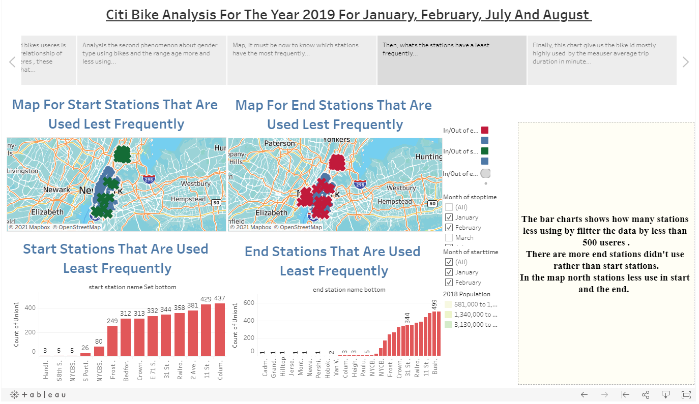

# Citibike

In this repo I used dataset from [Citi Bike Data](https://www.citibikenyc.com/system-data).
This sit contain many dataset for multi months in multi years, I choosed 4 months from 2019 and they are January, February, July And August.
 
 

The goal from these months to see there is different of bike useres from season to other plus I do other analysis for gender type, age, peak hours, bike id highly used and number of subscriber and customers.

I did create account in tableau public contains these analysis charts, maps and box text contains analysis for these charts [here](https://public.tableau.com/views/citibike_16166413675650/citibikestory?:language=en-GB&:display_count=y&:origin=viz_share_link).

1-  I will start with first phenomenon there is change of subscribers and customers using bikes from January and February to July and August also there is change in the time of the day mostly peak hour at 5pm and increase average of time duration in summer rather than winter, charts below explain that..
--- 

2- Second phenomenon is there are males useres greater than females in summer and winter times, about age distrbution range age from 1980-1990 they were the most used, take a look for charts below ..
---

## I created maps to know distrbution of stations in NYC with put marker for top and bottom stations and analytics for these maps ...
--- 

## Individual bikes that are mostly used ...
--- 

